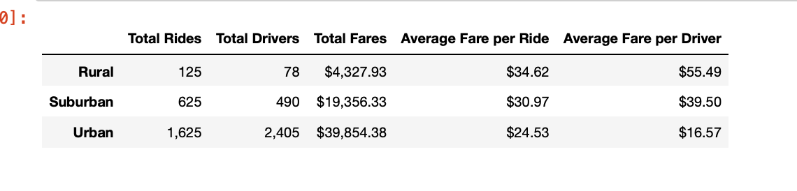
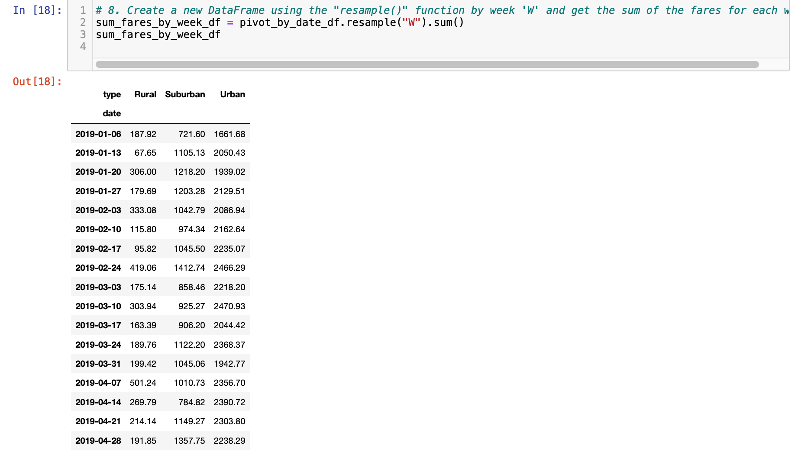
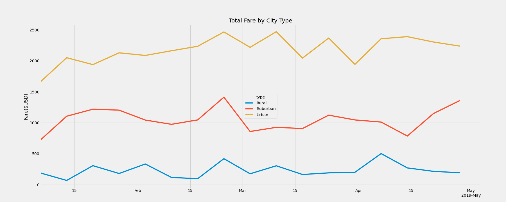

# Pyber_Analysis

### Project Overview 
The purpose of this analysis is to determine the revenue generated by the rides in different city types and also calculating the average fare by driver and average fare for each city type 

### Results

Over the course of four (4) months the data collected was analysed and the results are as follows:

Using the results of the analysis it was revealed that the rural drivers had the highest average number of rides at 1.6 and also the highest average revenue per ride at $55.49. 
The suburban drivers on average completed 1.27 rides with an average of $39.50 per ride 
The urban drivers completed less than 1 ride on average at 0.67 and also the lowest average revenue at $16.57
The rural region also returned the highes average fare per ride followed by the suburban and urban regions at $34.62, $30.97 and $24.53 respectively
The results can be seen outlined below :

A plot of the data was used to create the following chart which illustrates the changes on a weekly basis of the sum total of rides

* Source 

* Plot

### Summary 

Based on the results of the analysis it was revealed that there are some clear opportunites that need to addressed . 
I would propose the following 3 changes :

- Relocate 10 % of the urban drivers equally between the most active suburban and rural communities . This will help to adjust the average driver fare rate vs the average fair per ride 

- To reduce external operating costs , reduce number of suburban drivers between the months of March and Mid April 

- Increase urban fares by 5% which would increase total fares revenue and because urban rides are shorter should not lead to significant cost burden on customers. 

